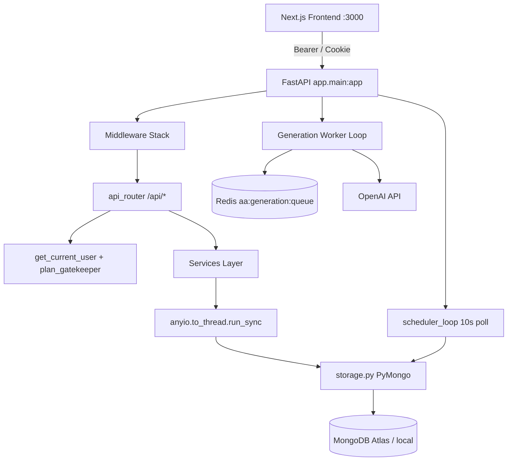
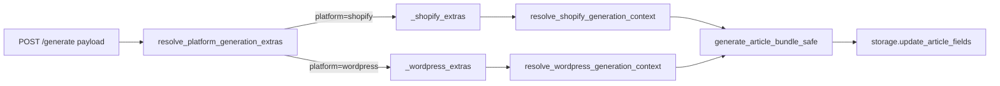
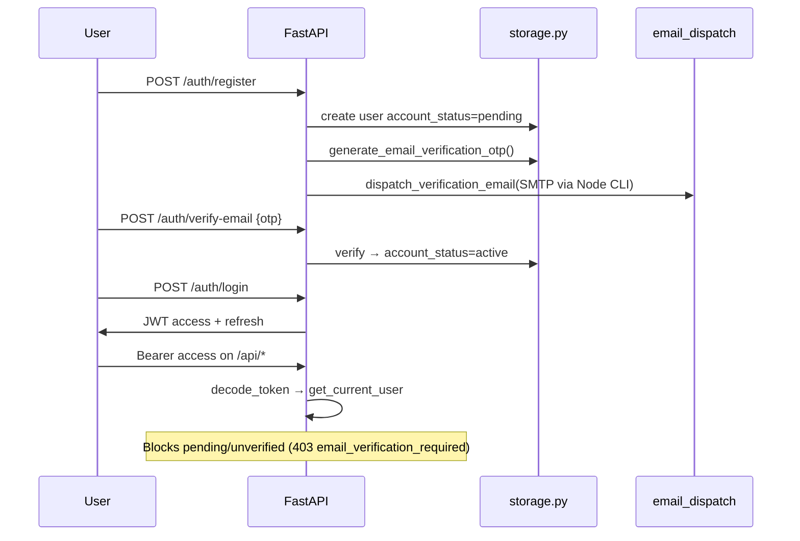

# Riviso Python Backend — Technical Architecture Blueprint

> **Scope:** Active workspace audit (`backend/` + repo-root `storage.py`, `database.py`).  
> **Framework:** FastAPI (ASGI) · **Persistence:** Synchronous PyMongo · **Queue:** Redis + in-process fallback  
> **Generated for:** optimization, bottleneck analysis, and MongoDB structural performance review.

---

## 1. Executive Summary

| Layer | Technology | Notes |
|-------|------------|-------|
| HTTP API | **FastAPI 0.x** (`app/main.py`) | Mounted at `/api`; OpenAPI disabled in production |
| Async runtime | **Uvicorn + asyncio** | Blocking I/O offloaded via `anyio.to_thread.run_sync` |
| Database | **PyMongo** (`database.py`, `storage.py`) | **Not Motor** — all Mongo access is synchronous |
| Cache / queue | **Redis** (`redis.asyncio`) | Generation job queue; falls back to `asyncio.Queue` |
| Background work | In-process tasks | No Celery/Arq; scheduler loop + generation worker per API process |
| Legacy bridge | `app/legacy/storage.py` | Imports repo-root `storage.py` module |
| Email | Node subprocess (`backend/email/`) | SMTP via Nodemailer CLI from Python |



---

## 2. Application Entry & Middleware Stack

**File:** `backend/app/main.py`

### 2.1 Lifespan hooks (startup)

| Task | Env flag | Purpose |
|------|----------|---------|
| `st.init_storage()` | always | Mongo connect + `init_db()` indexes |
| `start_generation_worker()` | `ENABLE_GENERATION_WORKER=1` (default) | Drains generation queue |
| `scheduler_loop(poll_seconds=10)` | `ENABLE_SCHEDULER=1` (default) | Posts due scheduled jobs |
| `subscription_daily_reset_loop()` | always | Resets daily usage counters |

### 2.2 Middleware order (inner → outer)

1. **PlanLimitsMiddleware** — trial-expired gate on mutating `/api/*` POST/PUT/PATCH/DELETE
2. **SlowAPIMiddleware** — rate limiting (`app/core/ratelimit.py`)
3. **SecurityHeadersASGIMiddleware** — CSP, X-Frame-Options, etc.
4. **GZipMiddleware** — responses ≥ 1 KB
5. **CORSMiddleware** — merged dev + production origins
6. **EnsureCorsASGIMiddleware** — ACAO on error responses

### 2.3 Global exception handlers

- **PyMongoError** → 503 (transient) or 500 JSON (never bare HTML 500)
- **RateLimitExceeded** → 429

---

## 3. API Routing — Complete Endpoint Catalog

**Base prefix:** `/api` (`settings.api_prefix`)

Router aggregation: `backend/app/api/router.py`

### 3.1 System & Health

| Method | Route | Handler module | Description |
|--------|-------|----------------|-------------|
| GET | `/api/health` | `routes/health.py` | Liveness; storage mode, GSC OAuth fingerprint, generation revision |
| GET | `/` | `main.py` | Service metadata (non-schema) |

### 3.2 Authentication & Profile

**Prefix:** `/api/auth` · `routes/auth.py`

| Method | Route | Description |
|--------|-------|-------------|
| POST | `/api/auth/login` | JWT access + refresh; blocks unverified accounts |
| POST | `/api/auth/register` | Creates pending user; sends verification OTP email |
| POST | `/api/auth/resend-verification` | Rate-limited OTP resend |
| POST | `/api/auth/verify-email` | Activates account from OTP |
| POST | `/api/auth/forgot-password` | Password reset email dispatch |
| POST | `/api/auth/reset-password` | Completes reset with token |
| POST | `/api/auth/reactivate` | Restores deactivated account |
| GET | `/api/auth/me` | Current user public record |
| POST | `/api/auth/refresh` | Rotates access token |

**Prefix:** `/api/profile` · `routes/profile.py`

| Method | Route | Description |
|--------|-------|-------------|
| GET | `/api/profile/me` | Profile + timezone |
| PATCH | `/api/profile/me` | Update profile fields |
| POST | `/api/profile/me/deactivate` | Soft deactivate |
| DELETE | `/api/profile/me` | Account deletion |

### 3.3 Subscription & Workspace

| Method | Route | Module | Description |
|--------|-------|--------|-------------|
| GET | `/api/user/subscription-status` | `user_subscription.py` | Trial countdown, usage, plan features |
| GET | `/api/workspace/overview` | `workspace.py` | Cross-project dashboard aggregates |

### 3.4 Projects

**Prefix:** `/api/projects` · `routes/projects.py`

| Method | Route | Description |
|--------|-------|-------------|
| GET | `/api/projects` | List owner projects (listing projection) |
| POST | `/api/projects` | Create project; seeds default prompts; `PlanAction.CREATE_PROJECT` |
| GET | `/api/projects/{project_id}` | Project detail |
| PATCH | `/api/projects/{project_id}` | Update metadata, platform, WP/Shopify fields |
| DELETE | `/api/projects/{project_id}` | Delete project |
| GET | `/api/projects/{project_id}/article-quota` | Article usage vs plan |
| GET | `/api/projects/{project_id}/feature-limits` | Per-feature monthly caps for UI |

### 3.5 Articles (core content pipeline)

**Prefix:** `/api/projects/{project_id}/articles` · `routes/articles.py`

| Method | Route | Description |
|--------|-------|-------------|
| GET | `.../titles` | Id + title refs (scheduled UI, research) |
| GET | `...` | Paginated list (`ArticleListPageResponse`) |
| POST | `...` | Create empty article row |
| POST | `.../bulk` | Bulk delete |
| POST | `.../bulk-upload` | CSV import |
| POST | `.../export/consume` | Export quota consumption |
| GET | `.../{article_id}/editor-shell` | Metadata without body (fast) |
| GET | `.../{article_id}/body` | Markdown body only |
| GET | `.../{article_id}` | Full article detail |
| GET | `.../{article_id}/featured-image` | Image URL / disk-backed image |
| GET | `.../{article_id}/generation-status` | Poll target for queued generation |
| GET | `.../{article_id}/cluster-link-context` | Topic cluster internal link hints |
| PATCH | `.../{article_id}` | Update title, body, meta, keywords |
| POST | `.../{article_id}/generate` | **Generate** text + optional image (202 queued or sync) |
| POST | `.../{article_id}/regenerate-image` | Featured image regen (queued or sync) |
| POST | `.../{article_id}/integrity/audit` | AI-detection audit (`integrity_engine`) |
| POST | `.../{article_id}/integrity/humanize` | Structural humanization pipeline |
| POST | `.../bulk-schedule` | Bulk schedule many articles |
| POST | `.../{article_id}/schedule` | Single-article WordPress schedule |
| POST | `.../{article_id}/publish` | **WordPress publish** (multipart; plugin-first) |
| POST | `.../{article_id}/shopify/publish` | **Shopify blog publish** |
| POST | `.../{article_id}/update-wordpress` | Push edits to existing WP post |
| POST | `.../{article_id}/sync-from-wordpress` | Pull WP post into article row |
| POST | `.../{article_id}/gsc/request-indexing` | Google Indexing API |
| GET | `.../{article_id}/gsc/indexing-status` | Indexing status readback |
| POST | `.../{article_id}/monitor/mark` | Mark for rank monitoring |
| POST | `.../{article_id}/monitor/refresh` | Stub (501) |

### 3.6 Prompts & Context Links

| Method | Route | Module |
|--------|-------|--------|
| GET/POST/PATCH/DELETE | `/api/projects/{id}/prompts[...]` | `prompts.py` — writing prompts |
| GET/POST/PATCH/DELETE | `/api/projects/{id}/image-prompts[...]` | `image_prompts.py` |
| GET/POST/PATCH/DELETE | `/api/projects/{id}/context-links[...]` | `context_links.py` — inline anchor phrases |

### 3.7 Scheduled Jobs

**Prefix:** `/api/projects/{project_id}/scheduled-jobs` · `routes/scheduled_jobs.py`

| Method | Route | Description |
|--------|-------|-------------|
| GET | `...` | List scheduled jobs |
| GET | `.../board` | Board view + stale-posting heal |
| PATCH | `.../{job_id}` | Reschedule / update prompts / WP meta |
| POST | `.../retry-failed-preparations` | Batch retry failed prep |
| POST | `.../{job_id}/retry-preparation` | Retry single job generation |
| POST | `.../{job_id}/post-now` | **Async** generate + publish (202 accepted) |
| DELETE | `.../{job_id}` | Cancel job |
| DELETE | `...` | Clear all scheduled |

### 3.8 WordPress Integration

**Module:** `routes/wordpress.py` (no router prefix — full paths)

| Method | Route | Description |
|--------|-------|-------------|
| GET | `/api/wordpress/plugin/download` | Riviso connector plugin ZIP |
| GET | `/api/projects/{id}/settings` | Project WP + generation settings |
| PATCH | `/api/projects/{id}/settings` | Update settings |
| POST | `/api/projects/{id}/wordpress/verify` | Credential + publish probe |
| GET | `/api/projects/{id}/wordpress/post-types` | WP REST post types |
| GET | `/api/projects/{id}/wordpress/categories` | WP categories |
| POST | `/api/projects/{id}/wordpress/sync-linked-articles` | Bulk link/sync WP posts |

### 3.9 Shopify Integration

| Method | Route | Module | Description |
|--------|-------|--------|-------------|
| GET | `/api/shopify/oauth/callback` | `shopify.py` | OAuth callback (global) |
| POST | `/api/projects/{id}/connect-shopify` | `project_shopify.py` | Connect flow entry |
| POST | `/api/projects/{id}/shopify/reauthorize-url` | | Re-auth URL |
| GET | `/api/projects/{id}/shopify/status` | | Connection + catalog counts |
| POST | `/api/projects/{id}/shopify/verify` | | Token validation |
| POST | `/api/projects/{id}/shopify/resolve-shop` | | Shop domain resolve |
| POST | `/api/projects/{id}/shopify/connect-url` | | OAuth URL |
| POST | `/api/projects/{id}/shopify/manual-connect` | | Custom app token connect |
| POST | `/api/projects/{id}/shopify/disconnect` | | Disconnect |
| POST | `/api/projects/{id}/shopify/sync` | | **Sync product catalog → `project.shopify_catalog`** |
| GET | `/api/projects/{id}/shopify/catalog` | | Read cached catalog |

### 3.10 Google Search Console

| Method | Route | Module |
|--------|-------|--------|
| GET/POST | `/api/gsc/*` | `gsc.py` — global OAuth |
| GET/POST/DELETE | `/api/projects/{id}/gsc/*` | `project_gsc.py` — per-project property |

### 3.11 Research, Topic Clusters, Site Map

| Method | Route | Module |
|--------|-------|--------|
| POST | `/api/projects/{id}/research/ideas` | `research.py` — queued SERP ideas |
| GET | `/api/projects/{id}/research/ideas/jobs/{cache_key}` | Poll research job |
| GET/POST | `/api/projects/{id}/topic-clusters[...]` | `project_topic_cluster.py` |
| GET/POST | `/api/projects/{id}/site-map[...]` | `project_site_map.py` — WP page index |
| POST | `/api/projects/{id}/validate-clusters` | `project_cluster_validation.py` |

### 3.12 Admin

**Prefix:** `/api/admin` · `routes/admin.py` · requires `require_admin`

| Method | Route | Description |
|--------|-------|-------------|
| GET | `/api/admin/storage-status` | Mongo vs JSON mode |
| GET/PATCH/DELETE | `/api/admin/users[...]` | User management |
| GET | `/api/admin/users/{id}/workspace` | Admin workspace view |
| GET/PUT | `/api/admin/plans[...]` | Plan configuration |

---

## 4. MongoDB Data Layer

### 4.1 Access pattern

```
FastAPI async route
    → await run_sync(storage_fn, ...)     # app/services/to_thread.py
        → call_storage(fn, ...)           # app/services/storage_db.py (retries)
            → storage.py function
                → get_db()                # database.py — sync MongoClient
                    → db.collection.find/aggregate/update...
```

**Key facts:**

- **Synchronous PyMongo only** — no Motor/async Mongo driver
- **JSON fallback** when `FORCE_JSON_STORAGE=1` or Mongo init fails (`storage._storage_mode`)
- **Retries:** `database.run_with_retry()` — 3 attempts, client reset on transient errors
- **API-layer retries:** `MONGODB_API_RETRY_ATTEMPTS` (default 2) via `call_storage()`

### 4.2 Collections & indexes

**Defined in:** `database.init_db()`

| Collection | Indexes |
|------------|---------|
| `projects` | `id` (unique), `owner_user_id`, `(owner_user_id, created_at)` |
| `articles` | `id` (unique), `project_id`, `(project_id, created_at)`, `(project_id, status, created_at)`, `(project_id, wp_scheduled_at)`, compound listing sort |
| `users` | `id` (unique), `email` (unique), TTL on verification/reset expiry |
| `scheduled_jobs` | `project_id`, `(project_id, run_at)`, `(state, run_at)`, `(project_id, state, article_id)` |
| `research_serp` | `(project_id, fetched_at)` |
| `research_ideas_runs` | `(project_id, created_at)` |
| `research_cache` | `saved_at` |
| `topic_clusters` | `(project_id, created_at)`, `(project_id, status)` |
| `subscriptions` | `user_id` (unique), `trial_end_date` |
| `plans` | `is_trial_plan` |

**Notable embedded documents (no separate collections):**

- `projects.prompts[]`, `projects.image_prompts[]`
- `projects.shopify_catalog` — synced product cache
- `projects.context_links[]`
- `articles.shopify_mapped_products[]`, `articles.wp_mapped_pages[]`

### 4.3 Aggregation pipeline patterns

**No `$lookup` joins** — all pipelines are single-collection on `articles`.

#### Listing projection (excludes heavy `article` body)

```python
# storage.py — _LISTING_PROJECTION_STAGE
{
    "$project": {
        "_id": 0,
        "id": 1,
        "project_id": 1,
        "title": 1,
        "keywords": 1,
        "status": {"$ifNull": ["$status", "pending"]},
        "focus_keyphrase": 1,
        "posted_at": 1,
        "created_at": 1,
        "updated_at": 1,
        "wp_post_id": 1,
        "wp_link": 1,
        "wp_last_wp_status": 1,
        "wp_scheduled_at": 1,
        "gsc_status": 1,
        "monitor_status": 1,
        "shopify_link": 1,
        "shopify_article_id": 1,
        "hasBody": {"$gt": [{"$strLenCP": {"$ifNull": ["$article", ""]}}, 0]},
    }
}
```

#### Paginated article list

```python
pipeline = [
    {"$match": _listing_match_for_project(pid, q=q, date_from=..., date_to=...)},
    _LISTING_PROJECTION_STAGE,
    {"$sort": {"created_at": direction}},
    {"$skip": skip},
    {"$limit": per_page},
]
db.articles.aggregate(pipeline, allowDiskUse=False)
```

#### Editor shell / regen metadata (no body, no image_url blob)

```python
pipeline = [
    {"$match": {"$or": [
        {"project_id": pid, "id": aid},
        {"_id": aid, "project_id": pid},
    ]}},
    {"$limit": 1},
    {"$project": {
        "_id": 0,
        "id": 1, "title": 1, "keywords": 1, "focus_keyphrase": 1,
        "shopify_mapped_products": 1, "wp_mapped_pages": 1,
        "has_featured_image": {"$or": [
            {"$gt": [{"$strLenCP": {"$ifNull": ["$image_url", ""]}}, 0]},
            {"$gt": [{"$strLenCP": {"$ifNull": ["$featured_image_generated_at", ""]}}, 0]},
        ]},
    }},
]
```

#### Workspace status counts (multi-project)

```python
pipeline = [
    {"$match": {"project_id": {"$in": project_ids}}},
    {"$group": {"_id": {"$ifNull": ["$status", "pending"]}, "n": {"$sum": 1}}},
]
```

#### Performance design choices

- **`hasBody` computed in Mongo** — avoids loading multi-MB markdown for list views
- **`allowDiskUse=False`** on hot paths — keeps aggregations in RAM
- **Featured images** — often disk-backed (`storage.featured_image_file_exists`) to keep `image_url` out of Mongo documents
- **Bottleneck risk:** Full-document reads when body/image still embedded; long OpenAI work + idle Mongo socket caused historical timeout issues (mitigated by async queue + `call_storage` retries)

---

## 5. Platform-Specific Workflow Isolation

### 5.1 Project platform discriminator

```python
# shopify_product_pipeline.py
def is_shopify_project(proj) -> bool:
    return (proj.get("platform") or "").strip().lower() == "shopify"

# wordpress_content_pipeline.py
def is_wordpress_project(proj) -> bool:
    plat = (proj.get("platform") or "wordpress").strip().lower()
    return plat not in ("shopify",) and plat != ""
```

**Router-level separation:**

| Concern | WordPress path | Shopify path |
|---------|----------------|--------------|
| Publish | `POST .../articles/{id}/publish` | `POST .../articles/{id}/shopify/publish` |
| Connect | `POST .../wordpress/verify` | `POST .../shopify/*`, `POST .../connect-shopify` |
| Product/page mapping | `mapped_pages` + site-map sync | `mapped_products` + catalog sync |
| Scheduled post-now | `scheduler.publish_article_to_wordpress()` | Same scheduler checks `wp_verified_status` (Shopify projects use Shopify publish route for manual) |

### 5.2 Unified generation router (platform extras)

**File:** `app/services/platform_generation.py`



**Returned extras merged into generation kwargs:**

| Key | Shopify | WordPress |
|-----|---------|-----------|
| `product_context` | Product blurbs for LLM | Internal page blurbs for LLM |
| `reference_image_url` | Product hero → **img2img** | Mapped page featured image → img2img |
| `shopify_mapped_products` | Persisted on article | — |
| `wp_mapped_pages` | — | Persisted on article |

### 5.3 Shopify product cache & mapping flow

```
POST /shopify/sync
  → shopify_sync service
  → storage.update_project_fields({ shopify_catalog: { products[], counts, scopes, warnings } })

Generation:
  Frontend sends mapped_products[] OR auto-select via select_relevant_shopify_products(proj.shopify_catalog)
  → normalize_mapped_products() → ShopifyMappedProduct[]
  → format_product_context() → LLM prompt block
  → first valid featured_image_url → reference_image_url (OpenAI image edit)

Post-generation:
  inject_shopify_product_links() — inline HTML anchors to /products/{handle}
```

**Catalog read:** `storage.get_project_shopify_catalog_doc(project_id)` — projection excludes full product arrays in listing queries.

### 5.4 WordPress internal linking & site map

```
POST /site-map/sync → indexes WP pages into project site_map
Generation:
  mapped_pages[] OR auto-select from site_map
  → resolve_wordpress_generation_context()
  → product_context string + reference_image_url
Post-generation:
  inject_wordpress_internal_links() — anchor tags to post_url
Publish:
  WordpressClient → riviso/v1/publish plugin route first, REST fallback
  apply_context_links_html() — project.context_links phrase → <a> injection
```

### 5.5 Context links (platform-agnostic)

**File:** `app/services/context_links.py`

- Stored on **project** as `{label, url}[]`
- Applied at **WordPress publish** time via HTML parser (skips text inside existing `<a>` tags)
- Independent of Shopify vs WordPress generation mapping

### 5.6 Img2img reference path

**File:** `app/services/article_generation.py`

```python
ref_url = (reference_image_url or "").strip() or None
# Passed to OpenAI image generation when generate_image=True
image_prompt = build_programmatic_image_prompt(..., image_prompt_text=image_text)
# reference_image_url used in image edit / style reference branch
```

---

## 6. Background Tasks, Queues & Gatekeepers

### 6.1 Generation queue architecture

**Not Celery/Arq** — custom Redis list + in-process worker.

| Component | File | Role |
|-----------|------|------|
| Queue | `generation_queue.py` | `LPUSH` / `BRPOP` on `aa:generation:queue` |
| Dedup | Redis key `aa:generation:dedup:{key}` | 6h TTL prevents duplicate jobs |
| Concurrency | `generation_slot()` semaphore | `MAX_CONCURRENT_GENERATIONS` (default 3) |
| Worker | `generation_worker.py` | `generation_worker_loop()` |
| Dispatch | `async_operation_dispatch.py` | Enqueue from API routes |

**Job kinds (`GenerationJobKind`):**

| Kind | Trigger | Worker handler |
|------|---------|----------------|
| `scheduled_prep` | Scheduler / schedule API | `_handle_scheduled_prep` |
| `scheduled_post_now` | Post Now API | `_handle_scheduled_post_now` |
| `article_generate` | POST `/generate` (202) | `_handle_article_generate` → `execute_article_generation` |
| `image_regenerate` | POST `/regenerate-image` | `_handle_image_regenerate` |
| `cluster_generate_all` | Topic cluster UI | `_handle_cluster_generate_all` |
| `topic_cluster_plan` | Cluster plan API | `_handle_topic_cluster_plan` |
| `research_ideas` | Research API | `_handle_research_ideas` |

**Async vs sync API behavior:**

```python
# articles.py
if should_use_async_queue():  # settings.generation_queue_enabled
    return JSONResponse(status_code=202, content={"status": "queued", ...})
async with generation_slot():
    return await execute_article_generation(...)
```

Frontend polls `GET .../generation-status` until `has_body` / `has_featured_image`.

### 6.2 Scheduler loop

**File:** `app/services/scheduler.py` — `scheduler_loop(poll_seconds=10)`

```
Every 10s:
  1. load_due_scheduled_jobs(states=[scheduled, ready_to_post, failed])
  2. _heal_premature_generating_jobs() — reset far-future stuck prep
  3. _dispatch_due_prep_jobs() — enqueue prep within SCHEDULE_PREP_LEAD_MINUTES (45)
  4. For each due job:
       claim → posting state
       prepare_article_for_scheduled_job() if needed
       publish_article_to_wordpress()
       mark posted / failed
```

**Post Now (manual):** API claims `posting` immediately → enqueues `SCHEDULED_POST_NOW` → worker runs full pipeline without blocking HTTP.

### 6.3 Integrity / humanization pipeline

**Route:** `POST .../integrity/humanize`

**File:** `app/services/integrity_engine.py` → `execute_structural_humanization()`

```
Markdown → split_markdown_paragraphs()
  → AIDetectionAuditor (riviso_linguistics)
  → humanize_markdown_blocks() on flagged indices
  → scrub_ai_markers() (riviso_paraphrase_engine)
  → run_grammar_pipeline() (riviso_grammar_engine)
  → polish_paragraph_natural() (riviso_human_profile)
Max 6 passes, target AI risk ≤ 6%
```

Gated by `PlanAction.HUMANIZE` (trial + plan limits).

### 6.4 Authentication flow



**Token sources:** `Authorization: Bearer` header OR `aa_access` cookie.

**Email dispatch:** `app/services/email_dispatch.py` → subprocess `npx tsx backend/email/sendCli.ts` → Nodemailer → SMTP (`SMTP_HOST`, `SMTP_PORT`, `SMTP_USER`, `SMTP_PASS`).

### 6.5 Plan limitation & trial gatekeepers

**Two layers:**

1. **PlanLimitsMiddleware** (`middleware/plan_limits.py`)  
   - All mutating `/api/*` except auth, health, subscription-status, admin  
   - Blocks if `is_trial_expired()` → 403 `{error: trial_expired}`

2. **Route dependencies** (`plan_gatekeeper.py`)  
   - `require_plan_action(PlanAction.*)` on specific endpoints  
   - Checks feature flags + consumes quotas via `storage.consume_*_usage()`

| PlanAction | Consumption / check |
|------------|---------------------|
| `GENERATE_CONTENT` | `consume_article_usage` (day + month) |
| `REGENERATE_IMAGE` | Regen limits on article row |
| `HUMANIZE` | Trial active |
| `SCHEDULE_POST` | `consume_scheduled_usage` |
| `BULK_UPLOAD` | `allow_bulk_upload` flag |
| `BULK_EXPORT` | `consume_export_usage` |
| `CREATE_PROJECT` | `max_projects` count |
| `CLUSTER_PLAN` | `consume_cluster_plan_usage` |
| `CUSTOM_RESEARCH` | `consume_custom_research_usage` |

**Subscription status API:** `build_subscription_status()` — trial remaining time, usage counters, feature caps.

**Daily reset:** `subscription_daily_reset_loop()` — background task for usage day rollover.

---

## 7. Critical Execution Maps

### 7.1 Article generate (queued — happy path)

```
POST /api/projects/{pid}/articles/{aid}/generate
  → require_plan_action(GENERATE_CONTENT)
  → _require_verified_website(proj)
  → enqueue_article_generation_job() → Redis
  ← 202 {status: "queued"}

Generation worker:
  → execute_article_generation()
  → resolve_platform_generation_extras() [Shopify|WordPress]
  → generate_article_bundle_safe() [OpenAI text + image]
  → storage.update_article_fields()

Frontend:
  → poll GET .../generation-status until has_body (+ has_featured_image)
  → GET editor-shell + body
```

### 7.2 WordPress publish

```
POST .../publish (multipart)
  → claim_scheduled_job_for_posting() if scheduled job exists
  → markdown → HTML
  → apply_context_links_html()
  → WordpressClient.publish_via_plugin() → riviso/v1/publish
  → resolve_featured_media_id() → upload if needed
  → update article wp_post_id, wp_link, status
```

### 7.3 Scheduled Post Now

```
POST .../scheduled-jobs/{jid}/post-now
  → patch writing_prompt_id, image_prompt_id, generate_image
  → claim state=posting
  → start_scheduled_job_post_now_task() → enqueue SCHEDULED_POST_NOW
  ← {status: "accepted", async: true}

Worker:
  → prepare_article_for_scheduled_job() if no body
  → publish_article_to_wordpress()
  → state=posted | failed
```

---

## 8. Known Bottlenecks & Optimization Targets

| Area | Risk | Current mitigation | Audit recommendation |
|------|------|-------------------|----------------------|
| Sync PyMongo in async routes | Event-loop blocking under load | `run_sync` thread pool | Monitor thread pool saturation; consider Motor for hot reads |
| Large `article` / `image_url` fields | Socket timeouts, slow aggregations | Listing projections, disk images | Audit documents >16MB; enforce projection on all read paths |
| Single-process worker | Queue stalls if worker dies | Redis persistence | Dedicated worker process per deployment; horizontal Redis consumers |
| Scheduler + worker same process | CPU contention with API | `ENABLE_SCHEDULER=0` on multi-worker | Separate scheduler deployment |
| Mongo idle timeout during generation | Historical 502/timeout | Async queue, `call_storage` retry | Already improved; verify `maxIdleTimeMS=30000` vs Atlas settings |
| No `$lookup` | Duplicated logic in app layer | Embedded catalogs | OK for current scale; revisit for cross-collection reporting |
| Email via subprocess | Latency, failure opacity | Fire-and-forget | Queue email jobs or use native SMTP library |
| Plan middleware DB read per POST | Extra Mongo round-trip | Admin skip | Cache trial status on JWT claims (short TTL) |

---

## 9. Configuration Reference (runtime behavior)

| Variable | Default | Effect |
|----------|---------|--------|
| `GENERATION_QUEUE_ENABLED` | `true` | 202 queued vs inline generation |
| `ENABLE_GENERATION_WORKER` | `1` | In-process queue consumer |
| `ENABLE_SCHEDULER` | `1` | Scheduled publish loop |
| `MAX_CONCURRENT_GENERATIONS` | `3` | OpenAI parallelism cap |
| `REDIS_URL` | `redis://localhost:6379/0` | Queue backend |
| `MONGODB_URI` | required | Atlas/local Mongo |
| `MONGODB_SOCKET_TIMEOUT_MS` | `20000` | PyMongo socket timeout |
| `MONGODB_API_RETRY_ATTEMPTS` | `2` | Storage retry wrapper |
| `SCHEDULE_PREP_LEAD_MINUTES` | `45` | When prep starts before publish |
| `FORCE_JSON_STORAGE` | off | Dev JSON file fallback |

---

## 10. Source File Index

| Domain | Primary files |
|--------|---------------|
| ASGI entry | `backend/app/main.py` |
| Routes | `backend/app/api/routes/*.py`, `backend/app/api/router.py` |
| Config | `backend/app/core/config.py`, `backend/app/core/deps.py`, `backend/app/core/security.py` |
| Storage | `storage.py`, `database.py`, `backend/app/legacy/storage.py`, `backend/app/services/storage_db.py` |
| Generation | `backend/app/services/article_generation.py`, `article_pipeline.py`, `generation_queue.py`, `generation_worker.py` |
| Platforms | `platform_generation.py`, `shopify_product_pipeline.py`, `wordpress_content_pipeline.py`, `wordpress_client.py` |
| Scheduler | `backend/app/services/scheduler.py`, `scheduled_jobs.py` |
| Integrity | `integrity_engine.py`, `riviso_*.py` |
| Plans / auth | `plan_gatekeeper.py`, `middleware/plan_limits.py`, `routes/auth.py`, `email_dispatch.py` |

---

*End of blueprint — Riviso backend infrastructure audit document.*
